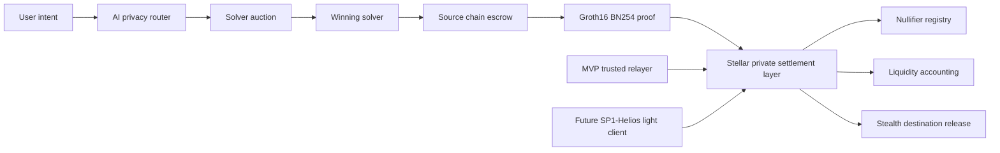

# ZeroPath v2 Blueprint

## 1. Complete Protocol Architecture

ZeroPath is a private cross-chain settlement network, not a manual bridge. Users submit intents. Solvers compete to satisfy them. Stellar coordinates private settlement, verifies proofs, tracks nullifiers, and accounts for liquidity.



Primary invariant: sender, receiver, amount, route, and liquidity source are hidden from public observers. Only proof validity, epoch-level batch accounting, and nullifier non-reuse are public.

## 2. Smart Contract Architecture

Ethereum contracts:

- `IntentEscrow`: accepts source deposits and emits commitment events.
- `SolverBondManager`: stakes solvers, slashes late or invalid settlement.
- `RouteRegistry`: registers source chain routes and solver permissions.
- `EmergencyGuardian`: pause, circuit breaker, and timelocked recovery.

Stellar contracts:

- `SettlementCoordinator`: verifies BN254 proofs and finalizes batch settlement.
- `NullifierRegistry`: prevents replay and double settlement.
- `LiquidityVault`: tracks private liquidity accounting by epoch.
- `LightClientRoot`: MVP relayer root today, SP1-Helios verified roots later.

## 3. Solidity Contracts

Solidity source-chain contracts are intentionally small. They lock liquidity, record opaque commitments, and avoid storing destinations. The destination is represented by `destinationCommitment`, never by a public address.

Security patterns:

- OpenZeppelin `AccessControl`, `Pausable`, `ReentrancyGuard`, `SafeERC20`.
- Explicit domain separators for replay protection.
- Per-chain nonce and intent hash uniqueness.
- Solver bond slashing for invalid or expired fills.

## 4. Soroban Contracts

Soroban is the settlement layer. It verifies Groth16 BN254 proofs using Protocol 25 CAP-0074 host functions:

- `bn254_add`
- `bn254_mul`
- `bn254_pairing`

The contract does not learn the route, sender, receiver, or raw amount. It verifies a proof over committed values and updates nullifier and liquidity state.

## 5. Circom Circuits

Core circuit: `private_settlement.circom`

Public inputs:

- `batch_root`
- `source_event_root`
- `nullifier_hash`
- `destination_commitment`
- `asset_id`
- `epoch`

Private inputs:

- `secret`
- `amount`
- `route_salt`
- `receiver_view_key`
- `source_event_path`
- `batch_path`

The circuit proves:

1. The source event exists in the source event tree.
2. The user knows the secret behind the commitment.
3. The nullifier is correctly derived.
4. The destination commitment is bound to a one-time stealth receiver.
5. The settlement belongs to the batch epoch.

## 6. SDK Architecture

SDK modules:

- `intent`: parse natural language or structured intents.
- `stealth`: generate destination commitments and one-time receiver keys.
- `proof`: fetch Merkle paths and generate Groth16 proofs in browser.
- `privacyScore`: compute pre-trade privacy score.
- `settlement`: submit proof to Stellar.
- `solver`: read quotes and selected route metadata without exposing private data.

Browser rule: secrets never leave the device.

## 7. Relayer Architecture

MVP relayer responsibilities:

- Watch source-chain commitment events.
- Maintain event trees and batch roots.
- Submit roots to Stellar `LightClientRoot`.
- Serve Merkle paths to clients.
- Never receive user secrets.

The relayer can censor but cannot steal or redirect funds because settlement requires a valid proof and unused nullifier.

## 8. SP1 Integration Plan

Upgrade path:

1. Use trusted relayer for hackathon MVP.
2. Run Helios inside SP1 to prove Ethereum consensus.
3. Extend with storage proofs for `IntentEscrow` roots.
4. Export Groth16 BN254 proof.
5. Verify the SP1 output on Stellar via CAP-0074.
6. Replace relayer root updates with verified SP1 root updates.

User flow remains unchanged.

## 9. Threat Model

Threats:

- Relayer posts invalid roots.
- Solver fails to deliver.
- Solver tries to infer routes from timing.
- User reuses notes or receiver commitments.
- Proof replay.
- Nullifier collision or omission.
- Contract upgrade compromise.
- Circuit constraint bug.
- Liquidity accounting mismatch.

Mitigations:

- Nullifier registry on Stellar.
- Intent deadlines and solver bonds.
- Epoch batching and timing cover.
- Destination commitments and one-time stealth receivers.
- Domain-separated proof inputs.
- Emergency pause and role separation.
- Independent circuit and contract audits.
- SP1-Helios upgrade path for root validity.

## 10. Database Schema

The database stores coordination metadata only. It must not store secrets, raw destination addresses, or receiver keys.

Tables:

- `intents`
- `solver_quotes`
- `settlement_epochs`
- `batch_members`
- `source_events`
- `proof_jobs`
- `privacy_scores`
- `solver_reputation`

See `db/schema.sql`.

## 11. API Design

Core endpoints:

- `POST /v1/intents/quote`
- `POST /v1/intents`
- `GET /v1/intents/:id`
- `GET /v1/solvers`
- `GET /v1/epochs/current`
- `GET /v1/merkle-proof/:chain/:leafIndex`
- `POST /v1/proofs/submit`

See `api/openapi.yaml`.

## 12. Frontend Architecture

Frontend screens:

- Cinematic homepage with AI intent console.
- Settlement route visualization.
- Privacy dashboard with score factors.
- Solver marketplace.
- Developer architecture section.

The UI never shows wallet addresses. It shows commitments, proof validity, anonymized routes, and completion state.

## 13. Component Hierarchy

```text
App
  Navigation
  Hero
    IntentConsole
    SettlementGlobe
  MetricsBand
  TransactionExperience
    RouteStop
    RouteTunnel
    ProofStrip
  PrivacyDashboard
    PrivacyOrb
    FactorList
  SolverMarketplace
    SolverCard
  ArchitectureSection
```

## 14. UI Wireframes

Homepage:

```text
┌────────────────────────────────────────────────────────────┐
│ ZeroPath        Settlement  Solvers  Architecture  Console │
├────────────────────────────────────────────────────────────┤
│ Move Value Privately.          Animated Stellar globe       │
│                                Chains orbit settlement      │
│ [AI intent console]            Encrypted tunnels            │
│ Move 5000 USDC privately...    Privacy shield 99%           │
└────────────────────────────────────────────────────────────┘
```

Settlement:

```text
Ethereum -> encrypted tunnel -> Stellar settlement -> encrypted tunnel -> Solana
Proof strip: Groth16 BN254 proof verified natively on Stellar.
```

Marketplace:

```text
Solver | Route Quality | Fee | Latency | Privacy Rating | Selected
```

## 15. Design System

Principles:

- Dark premium interface.
- Compact controls, strong hierarchy.
- No public addresses.
- Use proof, shield, route, and settlement metaphors.
- Cards have 8px radius or less.
- Green means verified privacy, blue means routing, amber means batching.

Tokens:

- Background: `#07080b`
- Surface: `#0d0f14`
- Text: `#f6f7f9`
- Muted: `#a0a7b4`
- Privacy green: `#55d68b`
- Route blue: `#78a8ff`
- Batch amber: `#e4b04a`

## 16. Production Deployment Strategy

MVP:

- Frontend on Vercel.
- Relayer on isolated container infrastructure.
- PostgreSQL for coordination metadata.
- Ethereum Sepolia source escrow.
- Stellar testnet Soroban settlement contract.

Production:

- Multi-region relayer nodes until SP1 replacement.
- Hardware-backed signer for relayer role.
- Defender or equivalent admin timelocks.
- Continuous proof verification monitors.
- Staged caps by asset and epoch.
- Bug bounty before uncapping TVL.

## 17. Audit Checklist

Contracts:

- Reentrancy and token callback safety.
- Role separation and timelock checks.
- Pause and unpause authority.
- Replay protection across chains.
- Nullifier uniqueness.
- Solver slashing correctness.
- Epoch accounting conservation.

Circuits:

- All public inputs domain separated.
- Destination commitment bound to receiver key.
- Nullifier cannot be chosen independently.
- Merkle path constraints complete.
- Amount conservation inside batch.
- No unconstrained signals.

Operations:

- Relayer key rotation.
- RPC failure modes.
- Batch root monitoring.
- Privacy score manipulation resistance.

## 18. Investor Pitch Narrative

Cross-chain finance still exposes user intent. Bridges reveal where money comes from, where it goes, how much moved, and which route was used. ZeroPath removes that leakage.

ZeroPath is the first privacy-first cross-chain settlement network using Stellar as a cryptographic settlement layer. Its moat is BN254 proof portability: Groth16 proofs generated from Ethereum-side events can be verified natively on Stellar through Protocol 25 CAP-0074 host functions.

The product feels like Stripe for private value transfer. The network works like UniswapX and Across for intent execution. The privacy model borrows the best ideas from privacy pools and stealth addresses. The infrastructure scales through batch settlement and future SP1-Helios light-client proofs.

The wedge is private USDC settlement across Ethereum, Stellar, Solana, and L2s. The long-term category is private cross-chain finance for institutions, payroll, treasury, commerce, and consumer transfers.
